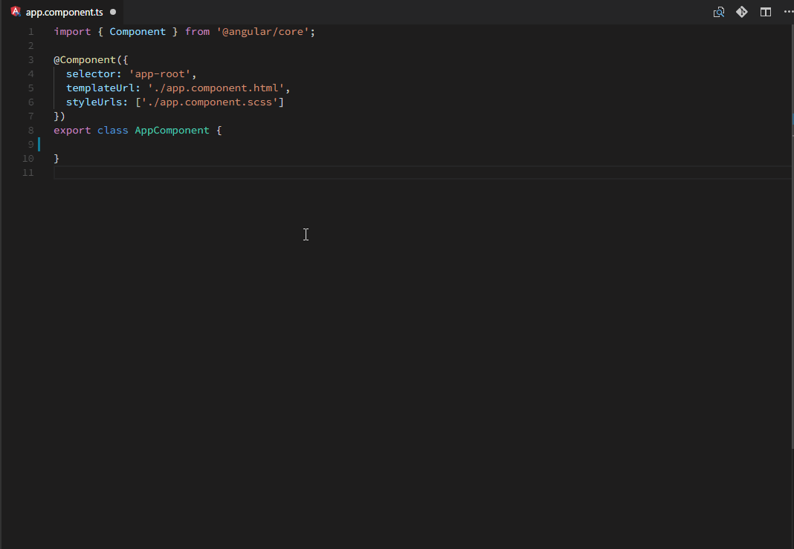

# F12 Open File



**F12: Open File** extension is a Definition Provider, which means it only react to 'Go to Definition'.

Use case: open Angular's `templateUrl` and `styleUrls` at a key stroke: F12 when cursor is within the url quotes, without any configuration.

## Usage

1.  move cursor to file name string in any file. A file name must be a string with single or double quote with relative path and file extension.
2.  press F12 to open.
3.  File is opened side by side. Add the following configration to `User Settings` to open in new tab:

```
"openFile.openSideBySide": false
```

Note: Only works with **relative** paths with full file name and extensions

## Links

[Source code](https://github.com/rexebin/F12-Open-File)

[Install "F12: Open File" from VSCode Marketplace](https://marketplace.visualstudio.com/items?itemName=rexebin.f12-open-file)
